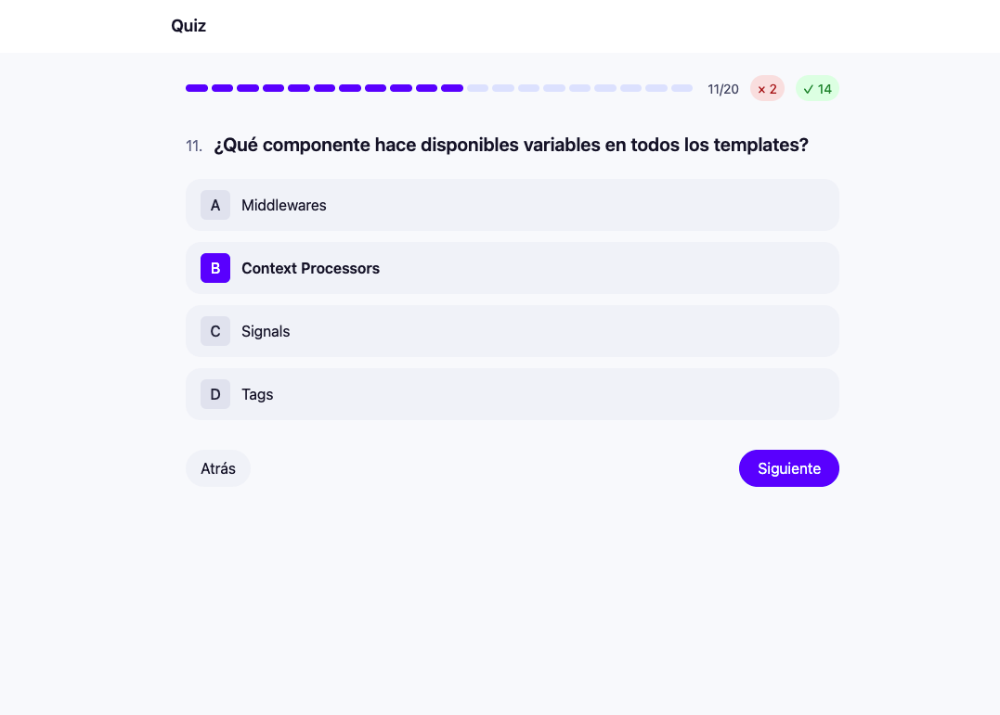

# Quiz interactivo multipasos con Python y Django

Aplicación de cuestionarios desarrollada con Django + HTMX y Tailwind (CDN). Las preguntas se almacenan en SQLite mediante el modelo `QuizQuestion`; el avance se bloquea hasta seleccionar una opción y al finalizar se muestran resultados con aciertos, errores y porcentaje.

## Puesta en marcha
1. Crear y activar entorno virtual (opcional):
   - macOS/Linux: `python3 -m venv .venv && source .venv/bin/activate`
   - Windows: `python -m venv .venv && .venv\\Scripts\\activate`
2. Instalar dependencias mínimas: `pip install Django`
3. Aplicar migraciones (crea la tabla y seed de preguntas): `python manage.py migrate`
4. Ejecutar servidor: `python manage.py runserver`
5. Abrir: `http://127.0.0.1:8000/` (o el puerto configurado)

## Uso
- Página principal: carga el quiz y muestra progreso segmentado.
- Navegación: “Siguiente” solo habilita tras elegir opción.
- Resultados: al terminar, se muestran en `/quiz/results`.
- Reinicio: botón “Reiniciar” en la página de resultados.
